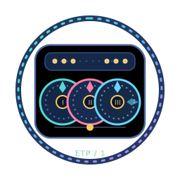

<p align="center">
  <br>
  <strong>Enigma Traffic Protocol</strong><br>
  一个受 Enigma 转子机启发、带认证的可打印流量编解码层
</p>

# Enigma Traffic Protocol (ETP/1)

[English](./README.md)

ETP/1 是一个面向 Go `net.Conn` 有序可靠字节流的流量混淆层。它先认证加密每条
记录，再使用受 Enigma 机启发的插线板、三个转子和反射器改变密文表示，最后映射为
可打印 ASCII 流，并可插入无需协商位置的填充字符。

ETP/1 仍处于实验阶段。仓库现在包含固定 TCP/UDP 目标、无认证 SOCKS5、HTTP CONNECT、
mux 以及可选 HTTP/TLS 的客户端/服务端模式。

## 核心特性

### Enigma 风格的流量表示

ETP/1 为每个方向派生一个 256 符号插线板、三个转子排列、进位位置、环设置和无固定
点反射器。每帧从自身序列号重新派生转子初始位置；用相同机器状态再次变换即可恢复
原始字节。

转子机只承担混淆变换，不提供密码学安全性。

### 可打印编码与任意位置填充

每个变换后的字节使用 64 字符可打印字母表中的两个字符表示。随机同义位使每个半字节
都有四种线表示。独立 padding 字母表中的字符可以插入任意编码字符之间，接收端无需
提前协商其位置。

### 认证记录

- AES-256-GCM 对每条记录加密并认证；
- HMAC-SHA-256 分别派生流量、转子、长度掩码和 nonce 材料；
- 每个方向持有独立的随机 salt、密钥、序列号和状态；
- 在读取帧体和分配内存前校验长度边界；
- 认证或结构校验失败后，该读取方向永久终止。

### 可选前向保密隧道握手

`internal/tunnel` 现已提供实验性的 ETPH/1：使用 PSK 保护的临时 X25519 握手、时间戳
校验和有界 nonce 重放缓存。握手派生的会话密钥会在 ETP/1 业务记录开始前替换静态
PSK。

## 当前支持

- Go 1.26 或更高版本；
- TCP 等有序、可靠的字节流；
- 一个并发读取者和一个并发写入者；
- 串行化多个并发写入；
- 自动将大写入拆分为有界记录；
- 从已认证记录中进行小缓冲区读取；
- 自定义可打印 cover 字母表和 padding 字母表；
- 认证 X25519 隧道升级层；
- 带显式目标协商的固定目标 TCP 客户端/服务端命令；
- 使用相同目标协商的无认证 SOCKS5 本地监听器；
- 延迟返回成功状态的 HTTP CONNECT 本地监听器。

## 缺点与 TODO

1. **裸 codec 无前向保密：** 直接调用 `pkg/enigma.NewConn` 只依赖配置密钥；需要时
   应使用 ETPH/1 隧道层。
2. **重放保护仅在进程内：** ETPH/1 会拒绝缓存中的客户端 nonce，但有界缓存不会在
   服务端重启后保留。
3. **不隐藏流量形态：** 连接端点、时序和总字节数仍然可见。
4. **仅可靠字节流：** 不支持乱序或丢包的数据报传输。
5. **代理协议有限：** 当前命令支持固定 TCP/UDP 目标、无认证 SOCKS5、HTTP CONNECT、
   mux、UoT 和可选 HTTP/TLS 包装。TUN、fallback 和动态目标 SOCKS UDP association 未包含。
6. **编码开销：** 未计可选填充时，每个变换后字节需要两个可打印字符。

## 快速开始

### 命令行隧道

```bash
go build -o enigma ./cmd/enigma
enigma keygen > enigma.key
```

启动只允许一个目标的服务端：

```bash
enigma server -listen :8443 -key-file enigma.key -allow-target example.com:80
```

启动本地固定目标转发器：

```bash
enigma client -listen 127.0.0.1:1080 \
  -server server.example.com:8443 -target example.com:80 \
  -key-file enigma.key
```

完整参数和部署说明见[命令行文档](./docs/COMMANDS.zh_CN.md)。
仓库路径和参考项目的职责对照见[架构说明](./docs/ARCHITECTURE.zh_CN.md)。
实验性的 [mux 设计说明](./docs/MUX.zh_CN.md) 记录当前逻辑流核心及其集成边界。
[UoT 设计说明](./docs/UOT.zh_CN.md) 记录有界的可靠流之上 UDP 数据报层。
[传输包装说明](./docs/TRANSPORT.zh_CN.md) 介绍可选的 HTTP 和 TLS 伪装层。

启动无认证 SOCKS5 本地监听器时，不设置 `-target`，改用 `-socks5`：

```bash
enigma client -socks5 -listen 127.0.0.1:1080 \
  -server server.example.com:8443 -key-file enigma.key
```

启动 HTTP CONNECT 本地监听器时不设置 `-target`，使用 `-http-connect`：

```bash
enigma client -http-connect -listen 127.0.0.1:1080 \
  -server server.example.com:8443 -key-file enigma.key
```

### Go Codec API

两端必须使用相同的高熵预共享密钥和兼容的 cover 配置。`Key` 至少为 32 字节，必须
来自密码学安全随机源，不能直接使用人类口令。

```go
package main

import (
	"bytes"
	"fmt"
	"io"
	"net"

	"Enigma/pkg/enigma"
)

func main() {
	rawClient, rawServer := net.Pipe()
	defer rawClient.Close()
	defer rawServer.Close()

	cfg := enigma.Config{
		// 仅用于演示；生产密钥必须随机生成并安全分发。
		Key:             bytes.Repeat([]byte{0x42}, 32),
		MinPadding:      4,
		MaxPadding:      16,
		MinCoverPadding: 2,
		MaxCoverPadding: 8,
	}

	client, err := enigma.NewConn(rawClient, cfg)
	if err != nil {
		panic(err)
	}
	server, err := enigma.NewConn(rawServer, cfg)
	if err != nil {
		panic(err)
	}

	received := make(chan []byte, 1)
	go func() {
		message := make([]byte, len("hello ETP/1"))
		if _, err := io.ReadFull(server, message); err != nil {
			panic(err)
		}
		received <- message
	}()

	if _, err := client.Write([]byte("hello ETP/1")); err != nil {
		panic(err)
	}
	fmt.Println(string(<-received))
}
```

第一次非空 `Write` 会延迟生成并发送 16 字节方向 session salt，第一次 `Read` 会读取
该 salt。因此在 `net.Pipe` 等无缓冲传输上，需要并发执行读取和写入。

## 文档

- [Go 配置说明](./docs/CONFIGURATION.zh_CN.md)
- [命令行客户端/服务端说明](./docs/COMMANDS.zh_CN.md)
- [ETP/1 线协议](./docs/PROTOCOL.md)
- [ETPH/1 认证握手](./docs/HANDSHAKE.md)
- [`pkg/enigma` 原始流 API](./pkg/enigma/README.md)
- [实现计划与路线图](./PLAN.md)

## 协议流程

```text
初始化：PSK + 方向随机 salt -> 会话密钥与转子表
发送：  payload -> 填充 -> AES-GCM -> Enigma -> 可打印 cover
接收：  cover 过滤 -> Enigma -> AES-GCM 验证 -> 已校验 payload
```

每个方向都是独立半流：

```text
direction := Cover(session_salt) || Cover(frame_0) || Cover(frame_1) || ...
frame_n   := Enigma_n(masked_length || aead_ciphertext)
plaintext := version || payload_length || payload || random_padding
```

精确派生标签、记录字段、限制和失败行为见[协议说明](./docs/PROTOCOL.md)。

## 测试

```bash
go fmt ./...
go test ./...
go vet ./...
```

环境支持 CGO 时建议运行竞态检测：

```bash
go test -race ./...
```

单独运行 fuzz 入口或性能基准：

```bash
go test -run '^$' -fuzz '^FuzzConnReadFrame$' ./pkg/enigma
go test -run '^$' -bench . -benchmem ./pkg/enigma
```

现有测试覆盖配置拒绝、转子自反性、逐序列状态、可打印填充、分片读取、多帧写入、
双向并发、错误密钥、记录篡改、非法 cover 字节、截断输入和机器可读的 ETP/1 兼容
向量。

## 项目结构

```text
pkg/enigma/
  config.go       公共配置与校验
  derive.go       域分离派生辅助函数
  rotor.go        插线板、转子、步进和反射器
  cover.go        可打印编码与填充过滤
  conn.go         AES-GCM 记录和 net.Conn 包装
  *_test.go       单元、双工、篡改和示例测试
internal/tunnel/  认证 X25519 升级和重放缓存
internal/app/     监听、目标拨号和双向转发
cmd/enigma/       keygen、服务端和客户端模式命令
```

`ref/sudoku-main` 仅用于研究传输分层和文档组织，不属于当前 Go module。ETP/1 没有
复制或导入其 GPL 源码及线格式。

## 声明

本实验性软件仅用于教育与研究。用户需自行评估其安全属性，并遵守适用的法律和网络
政策。

## 许可证

本仓库采用 [GNU Lesser General Public License v3](./LICENSE)。
